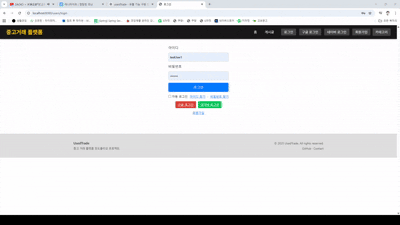
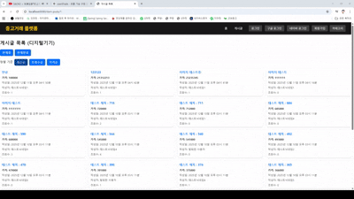
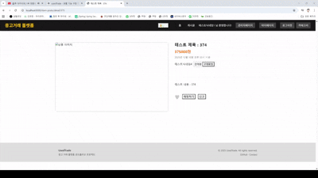
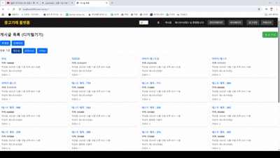

# 🛒 UsedTrade - 중고거래 플랫폼

JWT + OAuth2 + Redis 기반 실시간 알림 기능을 포함한 중고거래 웹 서비스입니다.

## 🛠 Tech Stack

- Backend: Spring Boot
- Security: Spring Security + JWT
- OAuth2: Google, Naver Login
- Database: MySQL
- Cache: Redis
- Real-time: WebSocket
- Template: JSP

## ✨ 주요 기능

- JWT 기반 인증/인가
- OAuth2 소셜 로그인 (Google, Naver)
- 실시간 채팅 (WebSocket)
- 거래 상태 변경 시스템
- 신고 기능 및 관리자 페이지
- Redis 기반 알림 처리

## 📸 Screen

### 로그인 화면

### 상품 등록

### 상태 변경 

### 신고하기

### 채팅

